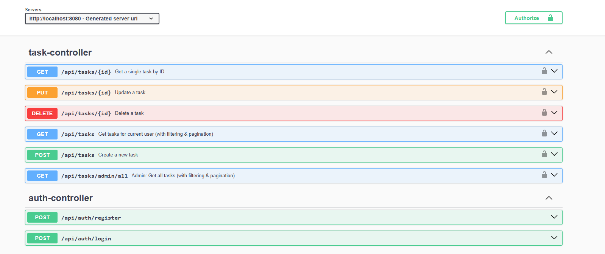
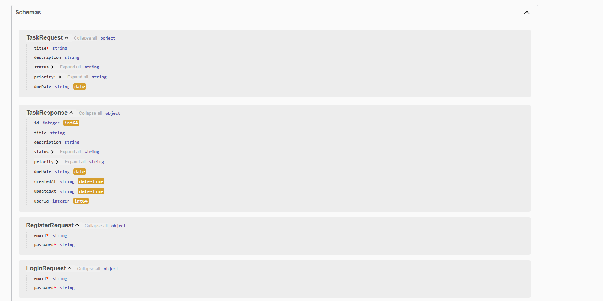
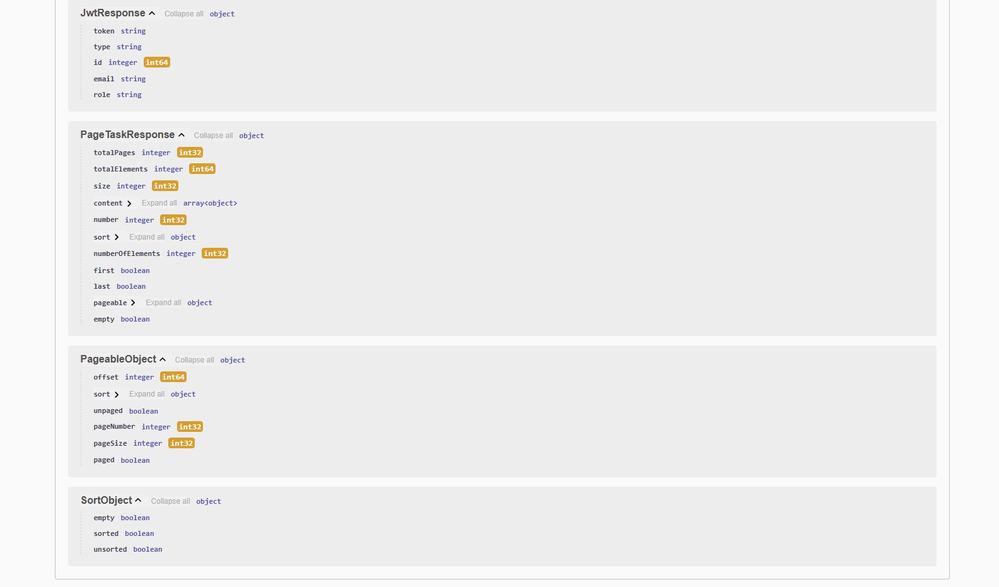

TaskFlow — Task Management Application

A full-stack task management application built with Next.js (frontend) and Spring Boot (backend), featuring JWT authentication, role-based access control, and a clean responsive UI.

Project Overview

TaskFlow allows users to create, manage, and track personal tasks with status and priority filtering. Admins have a dedicated view to monitor all tasks across every user.
Key Features

JWT-based authentication (login / register)
Role-based access: USER and ADMIN
Full CRUD for tasks (create, edit, delete, mark as done)
Filter by status, priority, and due date sorting
Paginated task tables
Admin view with created/updated timestamps
Responsive UI built with Tailwind CSS

Tech Stack

Frontend - Next.js 14, React, Tailwind CSS, Lucide React
Backend - Spring Boot 3, Spring Security, Spring Data JPADatabaseMySQL 8AuthJWT (JSON Web Tokens)

Backend — Spring Boot
Prerequisites
Java 17 or higher
Maven 3.8+
MySQL 8.0+

Database Configuration
1.Create a MySQL database:
CREATE DATABASE taskflow_db;
CREATE USER 'taskflow_user'@'localhost' IDENTIFIED BY 'your_password';
GRANT ALL PRIVILEGES ON taskflow_db.\* TO 'taskflow_user'@'localhost';
FLUSH PRIVILEGES;

2.Open src/main/resources/application.properties and configure:

# Server

server.port=8080

# Database

spring.datasource.url=jdbc:mysql://localhost:3306/taskflow_db?useSSL=false&serverTimezone=UTC&allowPublicKeyRetrieval=true
spring.datasource.username=taskflow_user
spring.datasource.password=your_password
spring.datasource.driver-class-name=com.mysql.cj.jdbc.Driver

# JPA / Hibernate

spring.jpa.hibernate.ddl-auto=update
spring.jpa.show-sql=false
spring.jpa.properties.hibernate.dialect=org.hibernate.dialect.MySQL8Dialect
spring.jpa.properties.hibernate.format_sql=true

# JWT

jwt.secret=your_jwt_secret_key_min_32_characters_long
jwt.expiration=86400000

# CORS (allow frontend origin)

app.cors.allowed-origins=http://localhost:3000

Steps to Run

1. Clone the repository and navigate to the backend folder:
   git clone https://github.com/sudeepa99/task_management_application.git
   cd taskflow/backend

2. Install dependencies and build the project:
   mvn clean install

3. Run the application:
   mvn spring-boot:run

API Endpoints

DB Schema

Frontend
Prerequisites
Node.js 18 or higher
npm or yarn

Environment Configuration
Create a .env.local file in the frontend root directory:
NEXT_PUBLIC_API_BASE_URL=http://localhost:8080/api

Steps to Run

1. Navigate to the frontend folder:
   cd taskflow/frontend

2. Install dependencies:
   npm install

3. Start the development server:
   npm run dev

Running the Full Application

1. Start MySQL and make sure taskflow_db exists
2. Start the backend: mvn spring-boot:run → runs on port 8080
3. Start the frontend: npm run dev → runs on port 3000
4. Open http://localhost:3000 in your browser
5. Register an account, or seed an admin user directly in the database:

## Why There Is No Admin Registration in the UI

TaskFlow intentionally does not provide any interface for registering or self-assigning the `ADMIN` role. This is a deliberate security decision, not an oversight.

Allowing users to select or request an admin role through the UI would introduce a critical privilege escalation vulnerability — any user could grant themselves elevated access, bypassing all access control entirely.

Instead, the `ADMIN` role is assigned exclusively through direct database access by a trusted system administrator. This ensures that elevated privileges can only be granted by someone who already has legitimate, controlled access to the underlying infrastructure.
